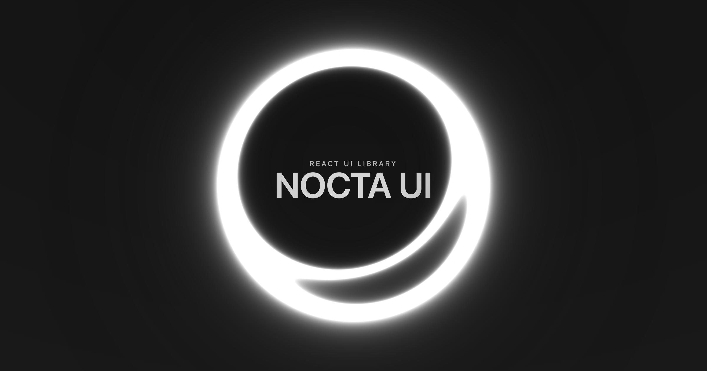

# Nocta UI

Nocta UI is a React component library built with a **copy-paste philosophy.** Instead of shipping as a heavy package, it provides source code you add directly to your project. This gives you **full control,** easy customization, and **no versioning headaches.**

## Philosophy

Nocta UI is designed around four core principles that guide every decision:

### **Minimal**
Clean components with no unnecessary complexity. Every element serves a purpose, every interaction feels natural. We believe in doing less, but doing it perfectly.

### **Performant** 
Copy-paste approach with CLI tooling. Components live in your codebase, giving you full control and customization power. No bundle bloat, no version conflicts.

### **Accessible**
WAI-ARIA compliant components with keyboard navigation, screen reader support, and semantic HTML. Accessibility isn't an afterthought—it's built in from the ground up.

### **Developer First**
Full TypeScript support, intuitive APIs, and comprehensive documentation for the best developer experience. Components that just work.

## Architecture

### Accessibility Foundation

Nocta UI’s interactive components are built on top of `@ariakit/react`, leveraging its proven accessibility primitives (focus management, keyboard navigation, and WAI-ARIA patterns) to deliver a great a11y experience by default.

### Copy-Paste Philosophy

Unlike traditional component libraries, Nocta UI follows the **copy-paste approach** pioneered by shadcn/ui. Instead of installing a package, you use our CLI to copy component source code directly into your project:

```bash
# Initialize your project with required dependencies
npx nocta-ui init

# Add components to your project
npx nocta-ui add button card badge

# Components are now in your /components/ui directory
# You own the code and can modify it however you want
```

**Why copy-paste?**
- **Full control** - modify components to fit your exact needs
- **No version conflicts** - components are copied, not installed
- **Easy customization** - change styling, behavior, or structure
- **Minimal dependencies** - lightweight with minimal external dependencies
- **React focused** - optimized for Next.js and Vite React projects

## Quick Start

1. **Initialize your project:**
```bash
npx nocta-ui init
```

2. **Add your first components:**
```bash
npx nocta-ui add button card
```

3. **Start building:**
```tsx
import { Button } from "@/components/ui/button"
import { Card, CardHeader, CardTitle, CardContent } from "@/components/ui/card"

function App() {
  return (
    <Card>
      <CardHeader>
        <CardTitle>Welcome to Nocta UI</CardTitle>
      </CardHeader>
      <CardContent>
        <Button variant="primary">Get Started</Button>
      </CardContent>
    </Card>
  )
}
```

## Requirements

- **React 18+**
- **TypeScript** (recommended)
- **Tailwind CSS v4**

The CLI automatically detects your framework and configures everything for you!

## Key Features

- **TypeScript First** - Full type safety and IntelliSense support
- **Dark Mode Native** - First-class dark mode support, not an afterthought
- **Composable Design** - Build complex interfaces by composing simple components
- **Performance Optimized** - Minimal re-renders and efficient animations
- **Accessible by Default** - WAI-ARIA compliant with comprehensive accessibility features
- **Customizable** - Full source code access means unlimited customization
- **Modern Styling** - Built on Tailwind CSS with systematic design tokens


## Documentation

Visit our [documentation site](https://nocta-ui.com) for:

## Contributing

We welcome contributions! Whether it's bug reports, feature requests, or code contributions, please feel free to open an issue or submit a pull request.

## License

MIT License - see [LICENSE](LICENSE) for details.

---

<div align="center">
  <p>
    <a href="https://nocta-ui.com">Documentation</a> •
    <a href="https://github.com/66HEX/nocta-ui/issues">Report Bug</a> •
    <a href="https://github.com/66HEX/nocta-ui/issues">Request Feature</a>
  </p>  
</div>
