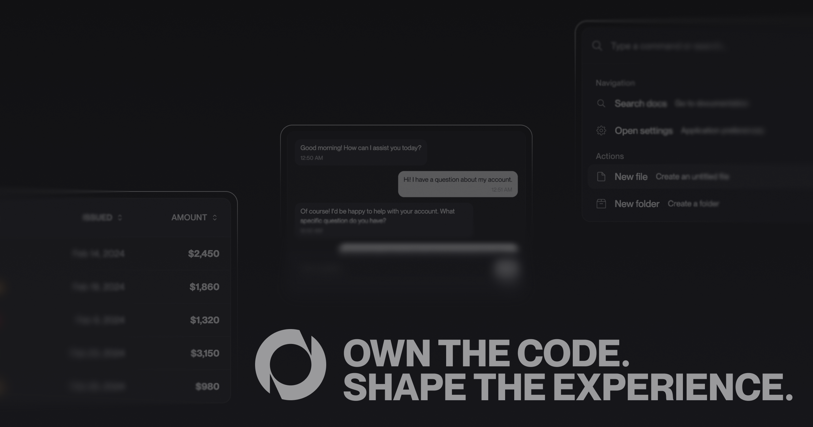

<p align="center">
  
</p>

<p align="center">
  <a href="https://nocta-ui.com">
    
  </a>
  <a href="https://github.com/66HEX/nocta-ui/issues">
    
  </a>
  
  
  
</p>


<h3 align="center">
  Nocta UI is a React component library built with a copy-paste philosophy.
</h3>

<p align="center">
  Instead of shipping as a heavy package, it provides source code you add directly to your project.<br/>
  This gives you <b>full control</b>, easy customization, and <b>no versioning headaches</b>.
</p>

---

## Philosophy & Architecture

Nocta UI merges its design philosophy with a lightweight and flexible architecture. It is built on four principles that shape every decision:

### **Minimal & Performant**

Clean components with no unnecessary complexity. Instead of being shipped as a package, Nocta UI uses a **copy-paste approach** via CLI tooling:

```bash
# Initialize your project with required dependencies
npx nocta-ui init

# Add components to your project
npx nocta-ui add button card badge

# Components are now in your /components/ui directory
```

* **Full control** – you own the code and can modify it however you want
* **No version conflicts** – components are copied, not installed
* **Easy customization** – adjust styling, behavior, or structure
* **React focused** – optimized for Next.js and Vite projects

### **Accessible by Default**

Accessibility is not an afterthought. Interactive components are built on top of `@ariakit/react`, leveraging proven accessibility primitives:

* Focus management
* Keyboard navigation
* WAI-ARIA patterns

This ensures a great a11y experience out of the box.

### **Developer First**

Nocta UI is designed for developers:

* Full TypeScript support with type safety and IntelliSense
* Intuitive APIs that “just work”
* CLI to quickly scaffold components into your project
* Clear and comprehensive documentation

### **Why Copy-Paste?**

This architectural choice is what makes Nocta UI unique:

* **You own the code** – no vendor lock-in
* **Zero versioning headaches** – updates are on your terms
* **Customizable** – change anything from styles to logic
* **Transparent** – components live in your codebase


## Quick Start

1. **Initialize your project:**

```bash
npx nocta-ui init
```

2. **Add your first components:**

```bash
npx nocta-ui add button card
```

3. **Start building:**

```tsx
import { Button } from "@/components/ui/button"
import { Card, CardHeader, CardTitle, CardContent } from "@/components/ui/card"

function App() {
  return (
    <Card>
      <CardHeader>
        <CardTitle>Welcome to Nocta UI</CardTitle>
      </CardHeader>
      <CardContent>
        <Button variant="primary">Get Started</Button>
      </CardContent>
    </Card>
  )
}
```

## Requirements

* **React 18+**
* **TypeScript** (recommended)
* **Tailwind CSS v4**

The CLI automatically detects your framework and configures everything for you!

## Key Features

* **TypeScript First** – full type safety and IntelliSense support
* **Dark Mode Native** – built-in dark mode support
* **Composable Design** – build complex interfaces by composing simple components
* **Performance Optimized** – minimal re-renders and efficient animations
* **Accessible by Default** – WAI-ARIA compliant components
* **Customizable** – you own the source code
* **Modern Styling** – powered by Tailwind CSS design tokens

## Contributing

We welcome contributions! Whether it's bug reports, feature requests, or code contributions, please feel free to open an issue or submit a pull request.

## License

MIT License - see [LICENSE](LICENSE) for details.

---

<div align="center">
  <p>
    <a href="https://nocta-ui.com">Documentation</a> •
    <a href="https://github.com/66HEX/nocta-ui/issues">Report Bug</a> •
    <a href="https://github.com/66HEX/nocta-ui/issues">Request Feature</a>
  </p>  
</div>
